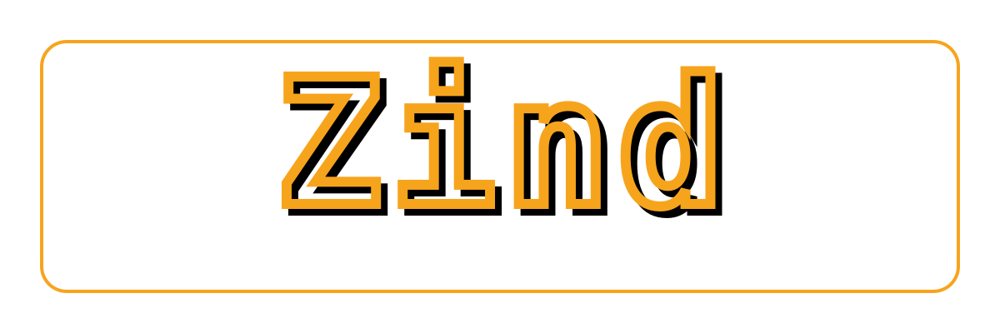

<!--
SPDX-FileCopyrightText: 2026 TSUKUMO Akito <tsukumoakito99@duck.com>
SPDX-License-Identifier: MIT
-->

<p align="center">
  
</p>

# Zind (Zig Structural API Indexer)

[日本語版のREADMEはこちら (Japanese version available here)](./README_ja.md)

[](https://ziglang.org)
[](LICENSE)

**Zind** is a dynamic, structural API indexing tool designed for the rapidly evolving Zig programming language.

In the midst of the significant changes from Zig 0.13 to 0.15 and now 0.16.0, static documentation and online resources often become outdated. Zind does not rely on external indices; instead, it performs direct **AST (Abstract Syntax Tree)** analysis on the **"Ground Truth"**—the actual Zig source code currently installed on your system—to provide immediate visualization of its logical structure.

---

## Repository Status

Zind respects developer privacy and decentralized technical infrastructure. **Codeberg** is our primary development hub.

- **Primary Repository (Source of Truth)**: [codeberg.org/tsukumoakito/zind](https://codeberg.org/tsukumoakito/zind)
  - Issue tracking, Pull Requests, Wiki, and discussions are managed here.
- **Mirror Repository**: [github.com/tsukumoakito/zind](https://github.com/tsukumoakito/zind)
  - Used for public outreach and binary distribution (Releases).

---

## Installation

Zind is written in Zig and provides a Makefile to automate the standard `zig build` workflow and system integration.

### 1. Build and Install (Source)

To build and install the binary, man pages, and documentation to your system:

```bash
# Clone the repository
git clone https://codeberg.org/tsukumoakito/zind.git
cd zind

# 1. Build the binary (checks for Zig 0.16.0)
make build

# 2. Install to system (/usr/bin, /usr/share/man, etc.)
sudo make install

# 3. Uninstall from system
sudo make uninstall
```

### 2. Arch Linux & Derivatives (AUR)

If you are using Arch Linux or an Arch-based distribution (e.g., Manjaro, EndeavourOS), the most reliable way to install is via the **AUR (Arch User Repository)**:

| Package | Version | Description | Votes | Links |
| :--- | :--- | :--- | :--- | :--- |
| **zind** |  | Dynamic structural API indexer for Zig |  | [](https://aur.archlinux.org/packages/zind) [](./LICENSE) |

Install using an AUR helper:

```bash
# Using yay
yay -S zind

# Using paru
paru -S zind
```

---

## Environment Adaptation

Zind automatically scans your environment to select the optimal settings.

- **Zvm / Standard Zig Support**:
  If the `zig` command is in your path, Zind automatically identifies the standard library (`std`) path associated with that specific binary. **This includes support for version managers such as `zvm`, `mise`, or `asdf`, provided the `zig` binary is correctly exported to your PATH.**
- **Analyze Arbitrary Zig Versions/Packages**:
  Use the `--std-path` flag to point Zind at a specific Zig version or a local package not in your standard path.
- **Explicit Language Setting**:
  Use `--lang <en|ja>` to override the automatic environment detection (based on `LC_ALL`, `LC_MESSAGES` or `LANG`).
  *Note: To maintain semantic consistency with Zig identifiers, localization is limited to help messages and documentation. The core indexing output remains in English.*

  ```bash
  # Search within a specific Zig version's standard library
  zind --std-path /path/to/zig-0.16.0/lib/std --search ArrayList
  ```

---

## Documentation

- **Man Pages**: Unix/Linux/macOS users can refer to `man zind` for terminal-native documentation.
- **Local Manual (Build Output)**: After running `zig build`, copies of the manual are available in `zig-out/doc/`. This is recommended for environments without `man` (e.g., native Windows).
- **Full Manual (Repository Source)**: For web-friendly reading or deep dive:
  - [User Manual (English)](./doc/MANUAL.md)
  - [User Manual (Japanese)](./doc/MANUAL_ja.md)

---

## Official Resources

Zind is a third-party exploration tool. For the standard toolchain and official documentation, please refer to:

- **Zig Toolchain**: Use `zig help` in your terminal to list standard commands.
- **Official Website**: [https://ziglang.org/](https://ziglang.org/) — The definitive portal for the Zig community and language specs.

---

## Objectives: A Compass for Zig Developers

In Zig development, the most accurate documentation is always the source code itself. However, navigating the labyrinth of the standard library can be daunting for beginners and experts alike.

Zind was developed to achieve three core goals:

1. **Eliminate Information Expiration**: Instantly locate namespaces that shift during updates (e.g., the transition from `std.os` to `std.posix`) using Fully Qualified Names (FQN).
2. **Visualize Implementation Lineage**: Determine if a symbol is a simple alias, a wrapper, or a factory function. Zind traces the lineage back to the ultimate definition.
3. **Evaluate Conditional Definitions**: Complex definitions that change based on OS or Architecture are filtered and identified based on your current environment or specific target flags.

---

## Detailed Options

### 1. Scope and Hierarchy Control

- `--scope <namespace>`
  Restrict the analysis to specific namespaces (e.g., `std.mem,std.fs`).
- `--depth <N|unlimited>`
  Set the recursion depth. `0` shows only the target; `unlimited` crawls every member beneath it.
- `--depth-scope <N> <scope>`
  An atomic flag to specify a precise depth for a specific scope.
- `--top-level` / `--top-level-sub`
  Presets to quickly view members of a primary namespace or their immediate children.

### 2. Search and Deep Inspection

- `--search <keywords>`
  Perform a keyword search across FQNs, doc comments, and constant values.
- `--probe <fqn>`
  Target a specific FQN to extract its implementation lineage and actual source code snippets.
- `--flagged-deprecated`
  Extract only symbols marked as `Deprecated`. Perfect for refactoring during version upgrades.

### 3. Environment Simulation

- `--target-os <os>` / `--target-arch <arch>`
  Simulate API definitions for platforms other than your current host.
- `--libc` / `--no-libc`
  Toggle conditional compilation paths based on C library linkage.

---

## EXPERIMENTAL / ROADMAP (Project Mode)

The following options are part of the Project Mode development roadmap. In the current version, using these will display a warning and terminate the analysis as they are not yet available.

- `--mode project`
  Enable experimental project-local symbol indexing.
- `--include <file1,...>` / `--exclude <file1,...>`
  Whitelist or blacklist specific files for project analysis.
- `--skeleton`
  Generate logic hierarchy and call graph skeletons.
- `--users <symbol>`
  List all references and call sites of a specific symbol.
- `--trace-up <symbol>`
  Trace logic propagation from a target back to entry points.

---

## Output Format Rules

Zind's output is designed to convey maximum implementation semantics in minimum lines.

- **Lineage Tracing (`>>>`)**
  `A = B >>> C`
  Indicates that symbol A is an alias for B, which is ultimately defined as C. This makes alias chains transparent.
- **Conditional Definitions (`[...]`)**
  `std.posix.Stat [native_os is linux] = ...`
  Clarifies the specific conditions (OS, Arch, build options) under which a definition becomes active.
- **Hidden Item Counts**
  - `(+n items)`: Public (`pub`) members that exist but are omitted due to depth settings.
  - `{+n items}`: Private internal implementation members. This serves as a metric for the complexity of a structure.

---

## License

Zind is released under the **MIT License**.
It is free for both personal and commercial use, provided the copyright notice and permission notice are included.

See the [LICENSE](./LICENSE) file for the full text.

## Support & Consulting

If you need professional support, custom feature development, or integration assistance with Zig 0.16.0 infrastructure, feel free to contact: [tsukumoakito99@duck.com](mailto:tsukumoakito99@duck.com)

---

## For Advanced Contextual Understanding

The high-density structured text output by Zind is more than just a human-readable "dictionary." It functions as a specialized protocol for transmitting **"Structural Semantics"** at an extremely low informational cost.

In modern workflows requiring semantic analysis or context compression—such as advanced static analysis engines or systems designed to ingest implementation intent—Zind serves as a robust interface for injecting the full scope of a language's current implementation with minimal token consumption.

To the trained eye, this output is not just text; it is a map.
